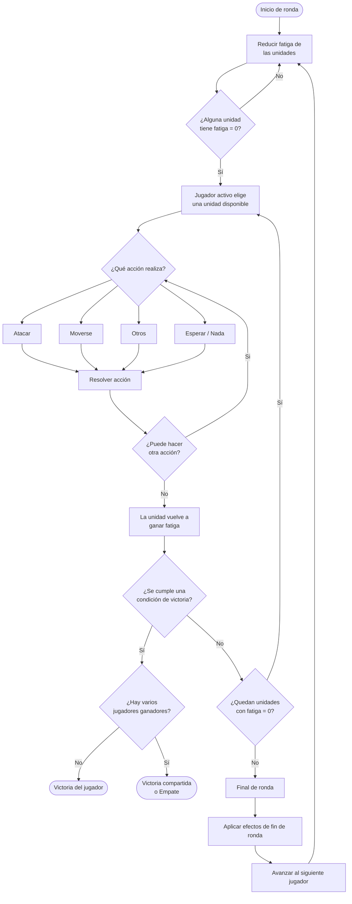
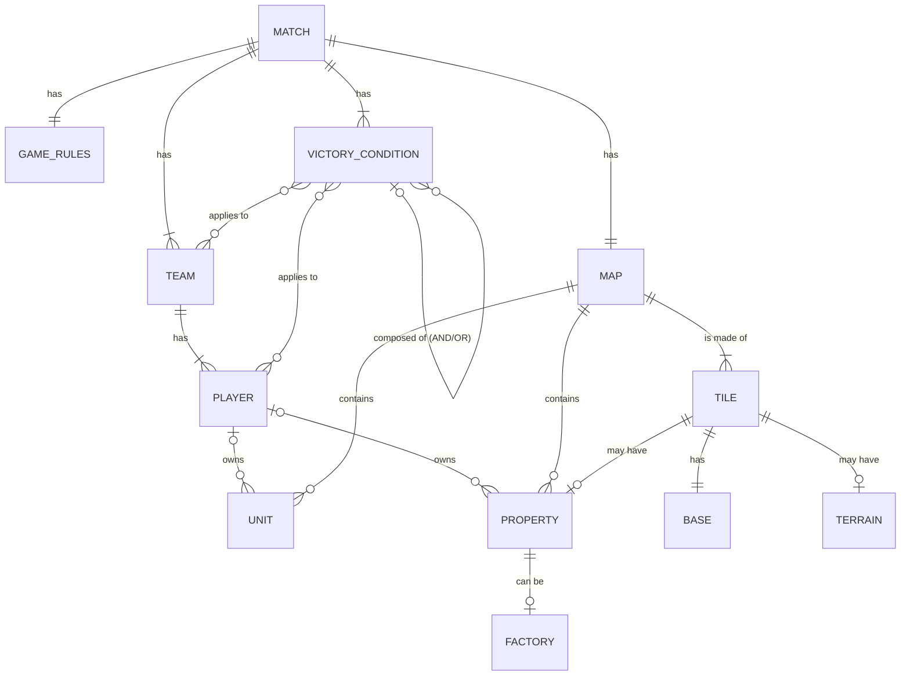
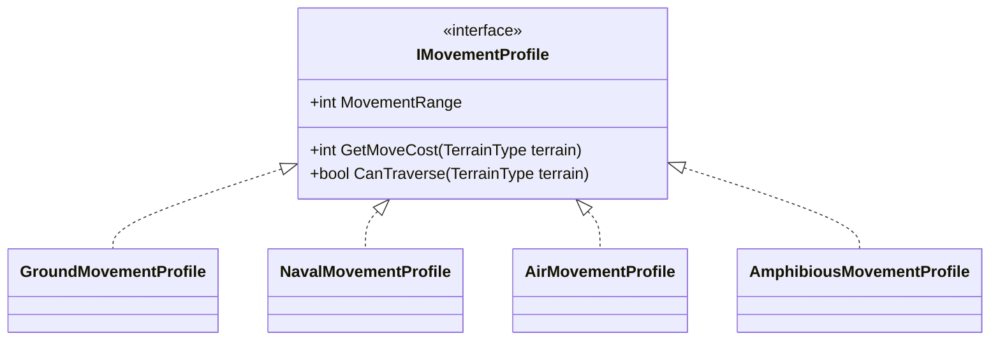
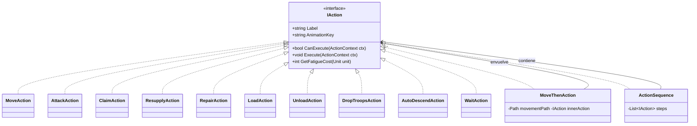
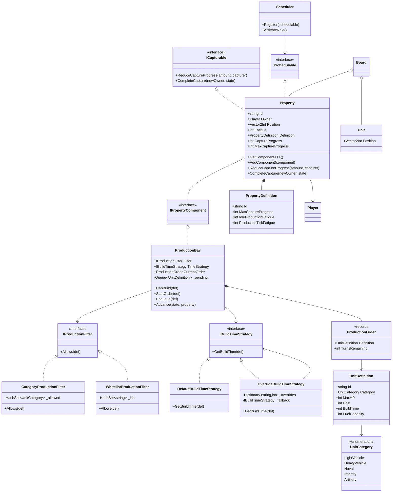
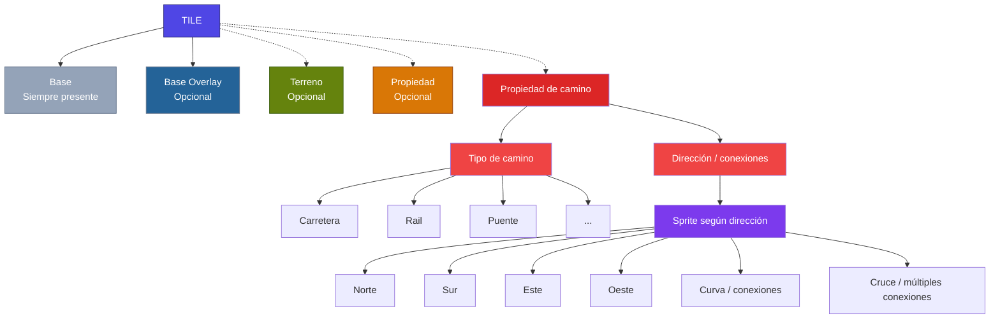
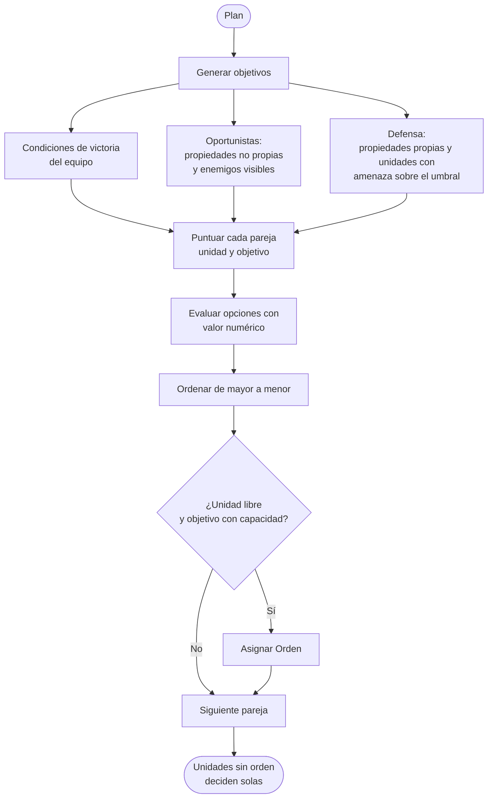

# Introducción

## Sobre este document

Este es el **Documento de Diseño de Juego** de **Grid Tactics**. El control de versiones de este documento tiene rama
propia en el repositorio de la web del juego.

El control de versiones de la web sigue el siguiente esquema:


> La rama `main` contiene únicamente lanzamientos completos. Esta rama se sube automáticamente a github pages.
>
> La rama `dev` es la rama de desarrollo. De esta salen las ramas `gdd` y `feature`.
>
> La carpeta `feature` contiene las ramas de nuevas características de la web.
>
> El GDD se modifica únicamente en la rama `gdd`.

# Grid Tactics

## Descripción general

Grid Tactics es un juego de estrategia en cuadrícula donde el o los jugadores se enfrentan a otros equipos o al entorno
para cumplir uno o vários objetivos. Se rige por un sistema de _fatiga_ que determina la próxima entidad en actuar.

Es un juego 2D pixel art con vista _top-down_.

El usuario puede avanzar por una serie de niveles que enseñan a jugar y demuestran diversas mecánicas y situaciones de
juego.

### Público objetivo

Jugadores que han jugado videojuegos anteriormente, pero no sean ávidos consumidores (jugadores casuales).

Adultos y jóvenes.

## Objetivo del producto

### MVP

El **Producto Mínimo Viable** debe permitir al usuario jugar una `partida`. La escena partida de Unity debe poder
recibir los
datos indispensables de una partida e iniciarla. Los elementos indispensables de una partida son:

* `Mapa`.
* `Reglas de juego`.
* `Condición de victoria`.
* `Equipos` con sus respectivos `jugadores`.

### MMP

El **Producto Mínimo Comercializable** debe contener:

* Una lista de niveles jugables que enseñen al usuario a jugar.
* Todas las herramientas de interfaz y navegación necesarias para jugar una partida y seleccionar un nivel. Esto incluye
  los ajustes del juego y elementos de accesibilidad.

### MAP

El **Producto Mínimo Asombroso** debe permitir lo siguiente:

* `Pass and Play` en un solo dispositivo.
* Creador de `partidas personalizadas`.
* Creador de `mapas`.
* Exportar e `importar partidas` con o sin guardado.
* Exportar e `importar mapas`.

## Especificaciones técnicas

El juego utiliza el motor de juego Unity.

* Idioma primario inglés con el uso
  del [Package Localization](https://docs.unity3d.com/Packages/com.unity.localization@2.0/manual/index.html) y se
  extiende al castellano en las fases finales de desarrollo.
* La interacción se hace a través del
  nuevo [Package Input System](https://docs.unity3d.com/Packages/com.unity.inputsystem@1.20/manual/index.html) the Unity
  para simplificar la interacción con ratón y pantalla táctil.
* El sistema de carpetas de Unity es semántico.

## Arte

El juego es 2D con pixel art a baja resolución (16px de ancho, orientativo).

Vista superior _top down_ como los juegos de Game Boy Advance _Pokemon Esmeralda_ o _Advance Wars_.

## Estéticas y contexto de juego

El usuario y sus rivales encarnan corporaciones cuyo objetivo es la explotación de recursos.

No existe un estado tradicional. Las corporaciones son las potencias soberanas gracias a su enorme capital y potencia
militar. Las batallas militares sustituyen a la competencia de mercado convencional. La **_guerra corporativa_** es
literal.

> Propuesta de título de juego siguiendo esta narrativa:
> * Corp Wars
> * Corp Conflict
> * Capital & Steel

La explotación de recursos y control de rutas comerciales estratégicas es el motivador principal del conflicto y el
justificante narrativo de los niveles.

Además de las corporaciones, existen grupos de mercenarios independientes. Ciertos niveles pueden contar con distintos
equipos formados por mercenarios independientes. Narrativamente, en futuros niveles estos pueden hacer equipo con
corporaciones rivales o el usuario para mostrar su falta de fidelidad a un bando.

Otras entidades posibles son vida salvaje o monstruos mutantes. La guerra corporativa resulta en el uso de energía y
armas nucleares que alteran el entorno.

### Papel del usuario

El usuario toma el papel de líder de su propia empresa/grupo mercenario y lucha por sus propios intereses aliándose con
aquellos grupos que comparten un objetivo común.

## Diagrama de navegación de usuario

El siguiente diagrama muestra todas las acciones posibles del usuario según el **MLP**.


> Para una mejor lectura, copia y pega el código `mermaid` en [esta web](https://mermaid.live/).

## Mecánicas

### Controles

El juego solo necesita un ratón o un dedo en una pantalla táctil para usarse en su totalidad.

### Ciclo de juego

Ciclo de juego de un jugador en un turno.



### Fatiga

Todas las entidades capaces de actuar se rigen por el sistema de fatiga. Cuando una entidad tiene fatiga 0 puede actuar.
Tanto las `unidades` como las `propiedades` se rigen por este sistema. Tras una acción, se le añadirá fatiga a la
entidad que actuó.

Caso de uso ajeno a las unidades: Si se quiere que un volcán erupcione de vez en cuando, este debe ser una `propiedad`
que forma su propio `equipo`. Se encola en la lista de entidades con fatiga y su IA de juego realiza la acción de
erupción cada vez que tiene la oportunidad. Esta acción puede añadirle una cantidad de fatiga aleatoria en un rango.

### Movimiento por resistencia

Las `unidades` tienen una capacidad de movimiento numérica. Las `tiles` tienen una capacidad de resistencia numérica.
Una unidad avanza menos casillas con más resistencia (ej. una montaña) que una con poca (ej. una carretera).

### Orientación de unidad

> <span style=color:red>Esta mecánica está en duda. Debe probarse y discutirse más a fondo</span>

El jugador decide a qué dirección (Arriba, Abajo, Derecha, Izquierda), mira una `unidad` cuando termina su turno.

Girar una unidad consume su recurso de capacidad de movimiento.

Una unidad puede tener restricción de ataque. Por ejemplo, un tanque que solo puede atacar hacia las casillas que mira.

La visibilidad de una unidad puede corresponder con la dirección que mira. Como ejemplo, un tanque que solo puede mirar
una casilla en todas direcciones y dos más hacia su frente.

### Niebla de guerra

Una `tile` puede ser, o no, visible. Las unidades y propiedades de un jugador aportan visibilidad según el alcance de
visibilidad de la unidad. Las unidades o color del propietario de una propiedad no son visibles si no se tienen unidades
que tengan visibilidad en esas `tiles`.

## Elementos de juego

El juego se rige por `partidas`. Un nivel es una partida.

Los distintos elementos siguen la siguiente relación



### Partida

Una partida está compuesta por un `mapa`, `equipos`, `reglas` y al menos una `condición de victoria`.

#### Nivel

Un `nivel` es una partida que tiene datos predefinidos por los diseñadores del juego.

Los niveles son accesibles en orden secuenciál o en grafo.

Deben comenzar de manera sencilla, con mapas pequeños y pocas unidades, e incrementar su dificultad.

### Equipo

Una `partida` debe tener al menos un equipo. Un equipo está compuesto por al menos un `Jugador`.

Este esquema permite crear partidas en las que varios jugadores hacen equipo.

En la lógica del juego, si se quiere tener un grupo de mónstruos ajenos, hostiles al resto de equipos, estos forman su
propio equipo y son controlados por un `jugador de IA`.

### Jugador

Un `Jugador` siempre es miembro de un `equipo`. Puede ser humano o IA.

Un usuario interactúa con el juego a través de esta clase.

```cs
public abstract class Player
{
    public string Id { get; }
    public Team Team { get; internal set; } = null!;
    public bool IsDefeated { get; internal set; }
    public int Funds { get; internal set; }
    public UnitSpriteSet SpritePack { get; set; } = null!;

    public abstract Task<IAction> ChooseAction(Unit unit, IEnumerable<IAction> options, GameState state);
}

public sealed class HumanPlayer : Player { }
public sealed class AIPlayer : Player { }
```

### Entidad

Una `entidad` es un elemento posicionable en el tablero.

```cs
public interface IPositioned { Vector2Int Position { get; } }
```

Estas pueden ser o no dañable y pueden ser o no curables

```cs
public interface IDamageable
{
    int CurrentHP { get; }
    int MaxHP { get; }
    void TakeDamage(int amount, GameState state, Unit? attacker = null);
}
```

```cs
public interface IHealable : IDamageable
{
    void Heal(int amount, GameState state);
}
```

Si la entidad puede actuar, debe seguir el esquema de fatiga y poder encolarse.

```cs
public interface ISchedulable
{
    string Id { get; }
    Player Owner { get; }
    int Fatigue { get; }
}
```

#### Unidad

Una `unidad` es una entidad controlable por un `jugador` en el `mapa`.

Un `jugador` puede tener `unidades`. Un jugador puede comenzar con unidades en el tablero si lo determina la partida o
puede crearlas en `fábricas` si existen en el mapa.

Diagrama de clase preliminar de `Unit`.


##### Armas

Las unidades disponen de una lista de `armas`. Esta lista puede estar vacía. Distintas armas tienen distinta efectividad
según el tipo de unidad objetivo.

Un arma puede tener `munición`. Si no tiene munición, no se puede usar. Una unidad puede obtener munición de distintas
maneras. Un arma puede tener munición infinita.

Si una unidad tiene más de un arma, usa la más efectiva frente a la unidad objetiva si tiene munición.

```cs
public enum WeaponClass { SmallArms, MachineGun, Cannon, Explosive, AntiAir, Torpedo, AirToAir, AirToGround }

public interface IWeapon
{
    string Name { get; }
    WeaponClass Class { get; }
    int MinRange { get; }
    int MaxRange { get; }
    int BaseDamage { get; }
    int? AmmoCost { get; } // null = infinite ammo
    bool IsUsableAgainst(IDamageable target);
}
```

##### Componente

Las unidades pueden tener distintos componentes. Estos añaden nuevas cualidades a la unidad.

```cs
public interface IUnitComponent { }
```

Un ejemplo es un tanque de combustible. Permite crear unidades que no se pueden mover al quedarse sin combustible.

Añadir una política al quedarse sin combustible permite definir lo que ocurre. Por ejemplo, las unidades aéreas se
estrellan y son eliminadas al quedarse sin combustible, pero las de tierra o marítimas solo dejan de poder moverse.

```cs
public interface IFuelDepletionPolicy { void OnFuelDepleted(Unit unit, GameState state); }

public sealed class DestroyOnEmptyFuel : IFuelDepletionPolicy
{
    public void OnFuelDepleted(Unit unit, GameState state)
    {
        unit.TakeDamage(unit.CurrentHP, state); // Eliminate unit
        state.Events.Publish(new UnitFuelDepleted(unit));
    }
}

public sealed class ImmobilizeOnEmptyFuel : IFuelDepletionPolicy
{
    //Do nothing: MovementBudget.For returns 0 with Current == 0
    public void OnFuelDepleted(Unit unit, GameState state) { }
}

public sealed class FuelTank : IUnitComponent
{
    public int Capacity { get; }
    public int Current { get; private set; }
    public bool ConsumesPerTurn { get; }
    public IFuelDepletionPolicy DepletionPolicy { get; }

    public FuelTank(int capacity, bool consumesPerTurn, IFuelDepletionPolicy? depletionPolicy = null)
    {
        Capacity = capacity; Current = capacity; ConsumesPerTurn = consumesPerTurn;
        DepletionPolicy = depletionPolicy ?? new ImmobilizeOnEmptyFuel(); // default for land or naval units
    }

    public bool Consume(int amount) { if (Current < amount) return false; Current -= amount; return true; }
    public void Refill(int amount) => Current = Math.Min(Capacity, Current + amount);
}
```

Otro módulo de ejemplo es el de carga. Este sirve para que una unidad pueda guardar otras unidades dentro según los
filtros del componente.

```cs
public enum UnitCategory { Infantry, Mech, LightVehicle, HeavyVehicle, Aircraft, Naval }

public sealed class TransportBay : IUnitComponent
{
    public int Capacity { get; }
    public IReadOnlyList<UnitCategory> AllowedCargo { get; }
    private readonly List<Unit> _cargo = new();
    public IReadOnlyList<Unit> Cargo => _cargo;

    public TransportBay(int capacity, IEnumerable<UnitCategory> allowed) { Capacity = capacity; AllowedCargo = allowed.ToList(); }
    public bool CanLoad(Unit unit) => _cargo.Count < Capacity && AllowedCargo.Contains(unit.Definition.Category);
    public void Load(Unit unit) => _cargo.Add(unit);
    public Unit Unload(string unitId) { var u = _cargo.First(x => x.Id == unitId); _cargo.Remove(u); return u; }
}
```

##### Movimiento

Una unidad tiene un `perfíl de movimiento`. Este determina su capacidad de movimiento en su puntaje de avance numérico y
el tipo de `tile` sobre los que puede pasar. Por ejemplo, los tanques no puede pasar por `tiles de montaña`.

El `TerrainType` no decide quién cruza qué: solo describe qué hay físicamente en la casilla. La pregunta "¿puede este
vehículo cruzar un bosque, a qué coste?", la responde el `IMovementProfile` de la unidad.



Uso de un `componente` de combustible para limitar el movimiento de la unidad.

```cs
public static class MovementBudget
{
    public static int For(Unit unit)
    {
        int baseRange = unit.Movement.MovementRange;
        var fuel = unit.GetComponent<FuelTank>();
        return fuel is null ? baseRange : Math.Min(baseRange, fuel.Current);
    }
}
```

##### Acción

Una unidad tiene a su disposición `acciones`. Distintas acciones pueden empezar a realizarse con N fatiga o menos. Cada
acción añade una cierta cantidad de fatiga tras realizarse o tras realizar una secuencia de acciones. Una acción puede
contar con un contador cooldown adicionál.

Ejemplo de aplicación:



```cs
public sealed record ActionContext(Unit Actor, GameState State, Vector2Int? Target = null, string? TargetUnitId = null);

public interface IAction
{
    string Label { get; }
    string AnimationKey { get; }
    bool CanExecute(ActionContext ctx);
    void Execute(ActionContext ctx);
    int GetFatigueCost(Unit unit);
}
```

#### Propiedad

Una `propiedad` es una construcción desplegada en un `mapa`.
Esta puede pertenecer o no a un `jugador`. Al igual que la unidad, tiene fatiga y componentes.

Una propiedad puede cambiar de manos durante una partida.

```cs
public interface IPropertyComponent { }

public sealed class Property : ICapturable, ISchedulable
{
    public string Id { get; }
    public Player? Owner { get; set; } // null = neutral, cant schedule
    public Vector2Int Position { get; internal set; }
    public int Fatigue { get; internal set; }
    public PropertyDefinition Definition { get; }
    public int CaptureProgress { get; private set; }
    public int MaxCaptureProgress => Definition.MaxCaptureProgress;

    private readonly List<IPropertyComponent> _components = new();
    public T? GetComponent<T>() where T : class, IPropertyComponent => _components.OfType<T>().FirstOrDefault();
    public void AddComponent(IPropertyComponent c) => _components.Add(c);

    public void ReduceCaptureProgress(int amount, Player capturer) => CaptureProgress = Math.Max(0, CaptureProgress - amount);
    public void CompleteCapture(Player newOwner, GameState state)
    {
        var previous = Owner;
        Owner = newOwner;
        CaptureProgress = Definition.MaxCaptureProgress;
        state.Events.Publish(new PropertyCaptured(this, newOwner, previous));
    }
}
```

##### Fábrica

Una `fábrica` es una entidad en el `mapa`.

Un `jugador` puede ser dueño de una `fábrica`. El jugador que la controle, puede crear unidades gastando los ahorros del
jugador.

Al igual que una `unidad`, una `fábrica` se pone en la cola de fatiga para actual.



Ejemplo de producción y filtros de producción de una fábrica como un `componente` de propiedad.

Distintos tipos de fábrica tienen a su disposición distintos filtros de producción.

```cs
public interface IProductionFilter { bool Allows(UnitDefinition def); }

public sealed class CategoryProductionFilter : IProductionFilter
{
    private readonly HashSet<UnitCategory> _allowed;
    public CategoryProductionFilter(params UnitCategory[] allowed) => _allowed = allowed.ToHashSet();
    public bool Allows(UnitDefinition def) => _allowed.Contains(def.Category);
}

public sealed class WhitelistProductionFilter : IProductionFilter
{
    private readonly HashSet<string> _ids;
    public WhitelistProductionFilter(params string[] unitDefIds) => _ids = unitDefIds.ToHashSet();
    public bool Allows(UnitDefinition def) => _ids.Contains(def.Id);
}
```

```cs
public interface IBuildTimeStrategy { int GetBuildTime(UnitDefinition def); }

public sealed class DefaultBuildTimeStrategy : IBuildTimeStrategy
{
    public int GetBuildTime(UnitDefinition def) => def.BuildTime;
}

public sealed class OverrideBuildTimeStrategy : IBuildTimeStrategy
{
    private readonly Dictionary<string, int> _overrides;
    private readonly IBuildTimeStrategy _fallback;
    public OverrideBuildTimeStrategy(Dictionary<string, int> overrides, IBuildTimeStrategy? fallback = null)
    { _overrides = overrides; _fallback = fallback ?? new DefaultBuildTimeStrategy(); }
    public int GetBuildTime(UnitDefinition def) => _overrides.TryGetValue(def.Id, out var t) ? t : _fallback.GetBuildTime(def);
}
```

```cs
public sealed record ProductionOrder(UnitDefinition Definition, int TurnsRemaining);

public sealed class ProductionBay : IPropertyComponent
{
    public IProductionFilter Filter { get; }
    public IBuildTimeStrategy TimeStrategy { get; set; }
    public ProductionOrder? CurrentOrder { get; private set; }
    private readonly Queue<UnitDefinition> _pending = new();

    public ProductionBay(IProductionFilter filter, IBuildTimeStrategy? timeStrategy = null)
    { Filter = filter; TimeStrategy = timeStrategy ?? new DefaultBuildTimeStrategy(); }

    public bool CanBuild(UnitDefinition def) => Filter.Allows(def);
    public void StartOrder(UnitDefinition def) => CurrentOrder = new ProductionOrder(def, TimeStrategy.GetBuildTime(def));
    public void Enqueue(UnitDefinition def) => _pending.Enqueue(def);

    public void Advance(GameState state, Property property)
    {
        if (CurrentOrder is null)
        {
            var choice = state.UI.PromptProduction(property.Owner!, Filter, state);
            if (choice is not null) StartOrder(choice);
            property.Fatigue += property.Definition.IdleProductionFatigue;
            return;
        }

        var order = CurrentOrder with { TurnsRemaining = CurrentOrder.TurnsRemaining - 1 };
        if (order.TurnsRemaining > 0) { CurrentOrder = order; property.Fatigue += property.Definition.ProductionTickFatigue; return; }

        var unit = UnitFactory.Create(order.Definition);
        CurrentOrder = null;
        if (_pending.Count > 0) StartOrder(_pending.Dequeue());

        var spot = state.Board.FindFreeAdjacentTile(property.Position, unit);
        if (spot is not null) { state.Board.PlaceUnit(unit, spot.Value); state.Scheduler.Register(unit); }
        else Enqueue(unit.Definition);

        property.Fatigue += property.Definition.ProductionTickFatigue;
    }
}
```

### Mapa

Un `mapa` está compuesto de `tiles` y contiene todas las `entidades` (`unidades` y `propiedades`).

Una `partida` tiene un mapa de juego. Todos los mapas son una cuadrícula rectangular.

#### Tile

Una `tile` se compone de la `base` y adicionalmente puede tener `terreno` y `propiedad`.

La `base overlay` sirve para que una `tile` de agua o suelo pueda integrarse como esquina o borde con otra de agua o
suelo. Si se crea un nuevo suelo, no es necesario crear todo un nuevo juego de tiles de bordes con el agua o viceversa.



### Reglas de juego

Una `partida` tiene `reglas de juego`. Estas especifican ciertos comportamientos de la partida.

Algunas de las reglas de juego tienen que ver con la _niebla de guerra_ y las interacciones de un jugador con otros de
su equipo.

| Regla                        | Opción 1                                                                                                   | Opción 2                                                                          |
|------------------------------|------------------------------------------------------------------------------------------------------------|-----------------------------------------------------------------------------------|
| Niebla de guerra             | Si                                                                                                         | No                                                                                |
| Niebla de guerra compartida  | Si<br>La visibilidad de un equipo es común a todos sus miembros.                                           | No                                                                                |
| Atravesar unidades aliadas   | Si<br>Las unidades pueden caminar a través de casillas ocupadas por unidades de ese jugador.               | No                                                                                |
| Atravesar unidades de equipo | Si<br>Las unidades pueden caminar a través de casillas ocupadas por unidades de otros miembros del equipo. | No                                                                                |
| Fondos iniciales             | Por defecto                                                                                                | Personalizados<br>Común a todos los jugadores o específicos por equipo o jugador. |

#### Condición de victoria

Una partida necesita al menos una `condición de victoria`.

Las condiciones de victoria pueden seguir reglas booleanas `AND` y `OR`. Una partida puede tener varias condiciones de
victoria.

Las condiciones de victoria pueden ser comunes a todos los `equipos` y `jugadores` o diferentes.

Ejemplos de condiciones de victoria:

* Eliminar todas las unidades del `equipo [NOMBRE DE EQUIPO]`.
* Eliminar todas las unidades del `jugador [NOMBRE DE JUGADOR]`.
* Controlar cierta `propiedad`.
* Tener más de `n` unidades.
* No tener menos de `n` unidades.
* Llevar a cierta `unidad` a una cierta `tile`.
* Realizar `otra/s condición/es de victoria` antes de `n turnos/tiempo`.

El sistema permite realizar condiciones de victoria asimétricas como estas:

* Equipo 1 (Jugador Humano 1)
* Equipo 2 (Jugador IA 2)

Condición OR de victoria `Equipo 1`:

* Controlar cierta `propiedad`: Cuartel General `Jugador IA 2`.
* Eliminar todas las unidades del `Equipo 2`.

Condiciones OR de victoria `Equipo 2`:

* Controlar cierta `propiedad`: Cuartel General `Jugador Humano 1`.
* Llevar a cierta `unidad` a una cierta `tile`.

### IA de juego

Se utiliza una arquitectura mixta para la inteligencia de los personajes no jugables.

Es sistema de `equipo`, `jugador` y `unidad` coordina acciones a distintos niveles.

* **Nivel de `jugador`**: evalúa las opciones, el entorno y los pasos necesarios para cumplir su objetivo. Publica
  objetivos y roles a sus unidades. Por ejemplo, _Unidad con Id:u1 capturar la ciudad con Id:c2_.
* **Nivel de `unidad`**: según los objetivos determinados por su jugador, enumera sus opciones y elige la mejor.

* Goal Oriented Action Planning: un `jugador` planea cómo cumplir su objetivo mediante la elaboration de subobjetivos
  que cambian a lo largo de la partida.
* Utility System: una `unidad` decide sus acciones con un sistema de utilidad. Este se ve afectado por el objetivo
  encomendado por la IA de `jugador`.
* Red bayesiana: un `jugador` realiza razonamientos sobre elementos que no puede ver o saber. Intenta predecir la
  posición de las unidades rivales que sabe que existen o podrán existir en la niebla de guerra. También intenta
  predecir los próximos objetivos de los equipos rivales. Por ejemplo, capturar una cierta ciudad o retirarse a una
  ubicación segura.
* Finite State Machine: ideal para entidades sencillas como vida salvaje o mercenarios.




## Monetización

Uso de modelo _Shareware_ / _Try Before You Buy_ igual que **DOOM** en su lanzamiento original.

Versión limitada del juego que permite jugar ciertos niveles iniciales. Las partidas personalizadas tienen limitaciones,
pero no impiden que puedan jugar hasta dos personas con pass and play. No es posible crear mapas ni importar o exportar
partidas.

Pago único para acceso completo a todas las características del juego.

Se abre la posibilidad a expandir el juego con expansiones que se compongan de nuevos sets de niveles.

El objetivo es que la mayor cantidad de usuarios prueben el juego y, con las funciones pass and play, puedan jugar con
otras personas sin que tengan que instalar el juego. Los niveles iniciales deben enseñar al primero a jugar para poder
explicar brevemente al segundo.

Una posible estrategia de retención para mantener el interés de los jugadores es que todos los jugadores pueden
participar en un reto preestablecido diário y semanal. Estos muestran la puntuación personal en comparación con el resto
de jugadores que han participado.

| Hook propio                                                   | Hook por otra persona                                                     | Monetización inicial                                                                                      |
|---------------------------------------------------------------|---------------------------------------------------------------------------|-----------------------------------------------------------------------------------------------------------|
| Por iniciaiva propoia, el usuario descarga y prueba el juego. | Por actividad social, el usuario es invitado a participar en una partida. | Consigue una pequeña oferta si consigues que n personas descarguen y prueben el juego gracias al usuario. |

| Hábito propio                                                                 | Hábito social                         | Progreso                                                                     |
|-------------------------------------------------------------------------------|---------------------------------------|------------------------------------------------------------------------------|
| El jugador se conecta regularmente y realiza los niveles diários y semanales. | El jugador incentiva a otros a jugar. | Comprar packs de sprites para las unidades propias o sets de niveles nuevos. |

| Hobby                                                                                                                                          | Consumibles                         |
|------------------------------------------------------------------------------------------------------------------------------------------------|-------------------------------------|
| El jugador con iniciativa propia y el social se han fusionado en uno. Todos los jugadores en esta categoría ya han comprado el juego completo. | El juego no cuenta con consumibles. |

# Recursos del documento

* [Mermaid visual editor](https://mermaid.ai/products/visual-editor)
* [Mermaid online editor](https://www.mermaideditor.io/)
