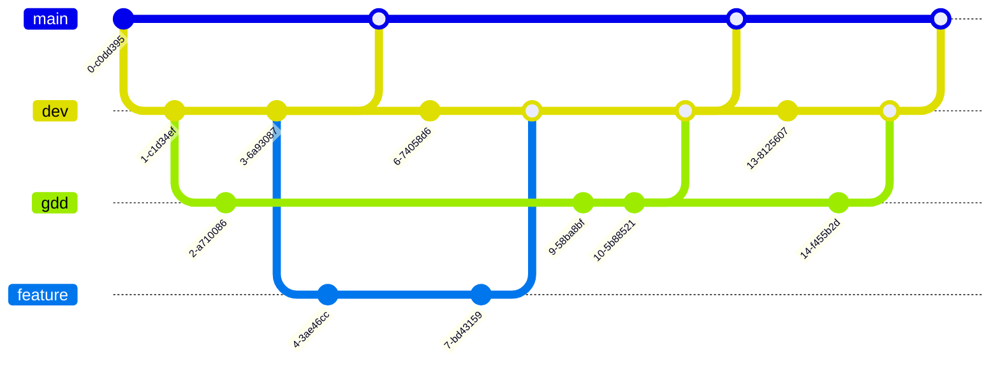
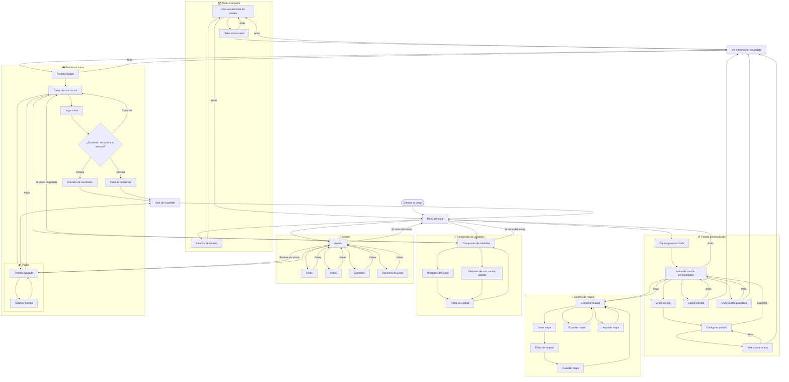
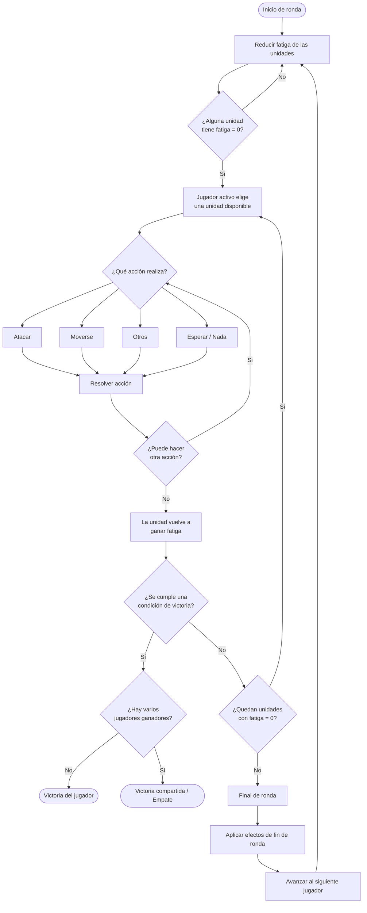
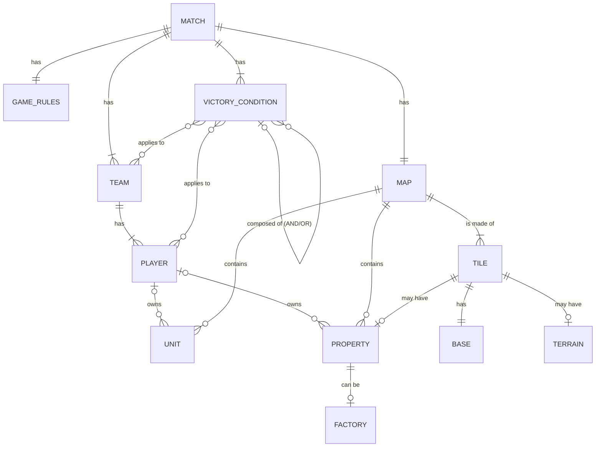
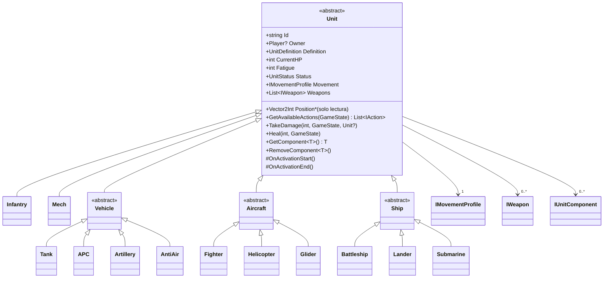
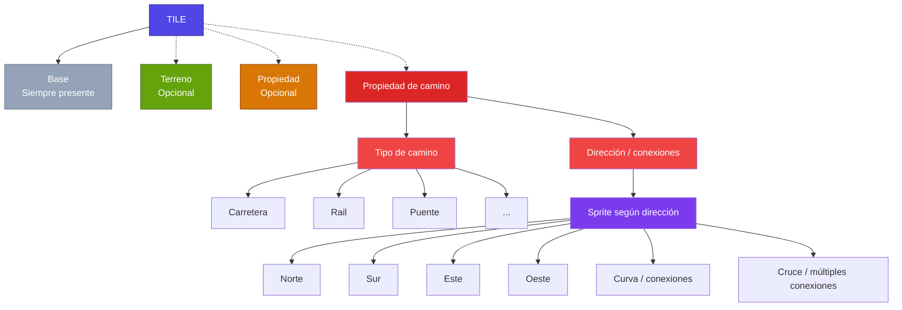

# Introducción

## Sobre este document

Este es el **Documento de Diseño de Juego** de **Grid Tactics**. El control de versiones de este documento tiene rama
propia en el repositorio de la web del juego.

El control de versiones de la web sigue el siguiente esquema:

> La rama `main` contiene únicamente lanzamientos completos. Esta rama se sube automáticamente a github pages.
>
> La rama `dev` es la rama de desarrollo. De esta salen las ramas `gdd` y `feature`.
>
> La carpeta `feature` contiene las ramas de nuevas características de la web.
>
> El GDD se modifica únicamente en la rama `gdd`.

# Grid Tactics

## Descripción general

Grid Tactics es un juego de estrategia en cuadrícula donde el o los jugadores se enfrentan a otros equipos o al entorno
para cumplir uno o vários objetivos. Se rige por un sistema de _fatiga_ que determina la próxima entidad en actuar.

Es un juego 2D con vista _top-down_.

El jugador puede avanzar por una serie de niveles que enseñan a jugar y demuestran diversas mecánicas y situaciones de
juego.

### Público objetivo

Jugadores que han jugado videojuegos anteriormente, pero no sean ávidos consumidores (jugadores casuales).

Adultos y jóvenes.

## Objetivo del producto

### MVP

El **Producto Mínimo Viable** debe permitir al usuario jugar una `partida`. La escena partida de Unity debe poder
recibir los
datos indispensables de una partida e iniciarla. Los elementos indispensables de una partida son:

* `Mapa`.
* `Reglas de juego`.
* `Condición de victoria`.
* `Equipos` con sus respectivos `jugadores`.

### MMP

El **Producto Mínimo Comercializable** debe contener:

* Una lista de niveles jugables que enseñen al usuario a jugar.
* Todas las herramientas de interfaz y navegación necesarias para jugar una partida y seleccionar un nivel. Esto incluye
  los ajustes del juego y elementos de accesibilidad.

### MAP

El **Producto Mínimo Asombroso** debe permitir lo siguiente:

* `Pass and Play` en un solo dispositivo.
* Creador de `partidas personalizadas`.
* Creador de `mapas`.
* Exportar e `importar partidas` con o sin guardado.
* Exportar e `importar mapas`.

## Especificaciones técnicas

El juego utiliza el motor de juego Unity.

* Idioma primario inglés con el uso
  del [Package Localization](https://docs.unity3d.com/Packages/com.unity.localization@2.0/manual/index.html) y se
  extiende al castellano en las fases finales de desarrollo.
* La interacción se hace a través del
  nuevo [Package Input System](https://docs.unity3d.com/Packages/com.unity.inputsystem@1.20/manual/index.html) the Unity
  para simplificar la interacción con ratón y pantalla táctil.
* El sistema de carpetas de Unity es semántico.

## Arte

El juego es 2D con pixel art a baja resolución (16px de ancho, orientativo).

Vista superior como los juegos de Game Boy Advance _Pokemon Esmeralda_ o _Advance Wars_.

## Estéticas y contexto de juego

El jugador y sus rivales encarnan corporaciones cuyo objetivo es la explotación de recursos.

No existe un estado tradicional. Las corporaciones son las potencias soberanas gracias a su enorme capital y potencia
militar. Las batallas militares sustituyen a la competencia de mercado convencional. La **_guerra corporativa_** es
literal.

> Propuesta de título de juego siguiendo esta narrativa:
> * Corp Wars
> * Corp Conflict
> * Capital & Steel

La explotación de recursos y control de rutas comerciales estratégicas es el motivador principal del conflicto.

Además de las corporaciones, existen grupos de mercenarios independientes. Ciertos niveles pueden contar con distintos
equipos formados por mercenarios independientes. Narrativamente, en futuros niveles estos pueden hacer equipo con
corporaciones rivales o el usuario para mostrar su falta de fidelidad a un bando.

Otras entidades posibles son vida salvaje o monstruos mutantes. La guerra corporativa resulta en el uso de energía y
armas nucleares que alteran el entorno.

### Papel del usuario

El usuario toma el papel de líder de su propia empresa/grupo mercenario y lucha por sus propios intereses aliándose con
aquellos grupos que comparten un objetivo común.

## Diagrama de navegación de usuario

> Para una mejor lectura, copia y pega el código `mermaid` en [esta web](https://mermaid.live/).

## Mecánicas

### Ciclo de juego

Ciclo de juego de un jugador en un turno.

### Fatiga

Todas las entidades capaces de actuar se rigen por el sistema de fatiga. Cuando una entidad tiene fatiga 0 puede actuar.
Tanto las `unidades` como las `propiedades` se rigen por este sistema. Tras una acción, se le añadirá fatiga a la
entidad que actuó.

Caso de uso extremo: Si se quiere que un volcán erupcione de vez en cuando, este debe ser una `propiedad` que forma su
propio `equipo`. Se encola en la lista de entidades con fatiga y su IA de juego realiza la acción de erupción cada vez
que
tiene la oportunidad. Esta acción le puede añadir una cantidad de fatiga aleatória en un rango.

### Movimiento por resistencia

Las `unidades` tienen una capacidad de movimiento numérica. Las `tiles` tienen una capacidad de resistencia numérica.
Una unidad avanza menos casillas con más resistencia (ej. una montaña) que una con poca (ej. una carretera).

### Orientación de unidad

> Esta mecánica está en duda. Debe probarse y discutirse más a fondo

El jugador decide a qué dirección (Arriba, Abajo, Derecha, Izquierda), mira una `unidad` cuando termina su turno.

Girar una unidad consume su recurso de capacidad de movimiento.

Una unidad puede tener restricción de ataque. Véase, un tanque que solo puede atacar hacia las casillas que mira.

La visibilidad de una unidad puede corresponder con la dirección que mira. Véase, un tanque que solo puede mirar una
casilla en todas direcciones y dos más hacia su frente.

### Niebla de guerra

Una `tile` puede o no ser visible. Las unidades y propiedades de un jugador aportan visibilidad. Las unidades o color
del propietario de una propiedad no son visibles si no se tienen unidades que tengan visibilidad en esos `tiles`.

## Elementos de juego

El juego se rige por `partidas`. Un nivel es una partida.

Los distintos elementos siguen la siguiente relación

### Partida

Una partida está compuesta por un `mapa`, `equipos`, `reglas` y al menos una `condición de victoria`.

### Equipo

Una `partida` debe tener al menos un equipo. Un equipo está compuesto por al menos un `Jugador`.

Este esquema permite crear partidas en las que varios jugadores hacen equipo.

En la lógica del juego, si se quiere tener un grupo de mónstruos ajenos hostiles al resto de equipos, estos forman su
propio equipo y son controlados por un `jugador de IA`.

### Jugador

Un `Jugador` siempre es miembro de un `equipo`. Puede ser humano o IA.

Un usuario interactúa con el juego a través de esta clase.

### Unidad

Una `unidad` es una entidad controlable por un `jugador` en el `mapa`.

Un `jugador` puede tener `unidades`. Un jugador puede comenzar con unidades en el tablero si lo determina la partida o
puede crearlas en `fábricas`.

Diagrama de clase preliminar de `Unit`.

### Propiedad

Una `propiedad` es una construcción desplegada en un `mapa`. Esta puede pertenecer o no a un `jugador`.

#### Fábrica

Una `fábrica` es una entidad en el `mapa`.

Un `jugador` puede ser dueño de una `fábrica`. El jugador que la controle, puede crear unidades.

Al igual que una `unidad`, una `fábrica` se pone en la cola de fatiga para actual.

### Mapa

Un `mapa` está compuesto de `tiles` y contiene todas las `entidades` (`unidades` y `propiedades`).

Una `partida` tiene un mapa de juego. Todos los mapas son una cuadrícula rectangular.

#### Tile

Una `tile` se compone de la `base` y adicionalmente puede tener `terreno` y `propiedad`.

### Reglas de juego

Una `partida` tiene `reglas de juego`. Estas especifican ciertos comportamientos de la partida.

Algunas de las reglas de juego tienen que ver con la _niebla de guerra_ y las interacciones de un jugador con otros de
su equipo.

| Regla                        | Opción 1                                                                                                   | Opción 2                                                                          |
|------------------------------|------------------------------------------------------------------------------------------------------------|-----------------------------------------------------------------------------------|
| Niebla de guerra             | Si                                                                                                         | No                                                                                |
| Niebla de guerra compartida  | Si La visibilidad de un equipo es común a todos sus miembros.                                           | No                                                                                |
| Atravesar unidades aliadas   | Si Las unidades pueden caminar a través de casillas ocupadas por unidades de ese jugador.               | No                                                                                |
| Atravesar unidades de equipo | Si Las unidades pueden caminar a través de casillas ocupadas por unidades de otros miembros del equipo. | No                                                                                |
| Fondos iniciales             | Por defecto                                                                                                | Personalizados Común a todos los jugadores o específicos por equipo o jugador. |

#### Condición de victoria

Una partida necesita al menos una `condición de victoria`.

Las condiciones de victoria pueden seguir reglas booleanas `AND` y `OR`. Una partida puede tener varias condiciones de
victoria.

Las condiciones de victoria pueden ser comunes a todos los `equipos` y `jugadores` o diferentes.

Ejemplos de condiciones de victoria:

* Eliminar todas las unidades del `equipo [NOMBRE DE EQUIPO]`.
* Eliminar todas las unidades del `jugador [NOMBRE DE JUGADOR]`.
* Controlar cierta `propiedad`.
* Tener más de `n` unidades.
* No tener menos de `n` unidades.
* Llevar a cierta `unidad` a una cierta `tile`.
* Realizar `otra/s condición/es de victoria` antes de `n turnos/tiempo`.

El sistema permite realizar condiciones de victoria asimétricas como estas:

* Equipo 1 (Jugador Humano 1)
* Equipo 2 (Jugador IA 2)

Condición OR de victoria `Equipo 1`:

* Controlar cierta `propiedad`: Cuartel General `Jugador IA 2`.
* Eliminar todas las unidades del `Equipo 2`.

Condiciones OR de victoria `Equipo 2`:

* Controlar cierta `propiedad`: Cuartel General `Jugador Humano 1`.
* Llevar a cierta `unidad` a una cierta `tile`.

## Monetización

Uso de modelo _Shareware_ / _Try Before You Buy_ igual que **DOOM** en su lanzamiento original.

Versión limitada del juego que permite jugar ciertos niveles iniciales. Las partidas personalizadas tienen limitaciones,
pero no impiden que puedan jugar hasta dos personas con pass and play. No es posible crear mapas ni importar o exportar
partidas.

Pago único para acceso completo a todas las características del juego.

Se abre la posibilidad a expandir el juego con expansiones que se compongan de nuevos sets de niveles.

El objetivo es que la mayor cantidad de usuarios prueben el juego y, con las funciones pass and play, puedan jugar con
otras personas sin que tengan que instalar el juego. Los niveles iniciales deben enseñar al primero a jugar para poder
explicar brevemente al segundo.

# Recursos del documento

* [Mermaid visual editor](https://mermaid.ai/products/visual-editor)
* [Mermaid online editor](https://www.mermaideditor.io/)
