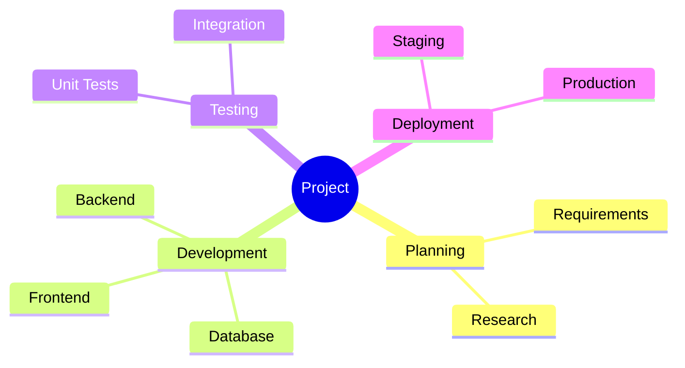
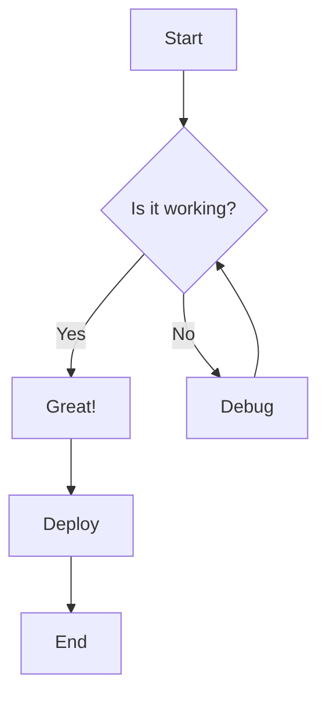
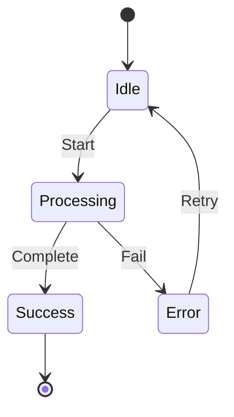
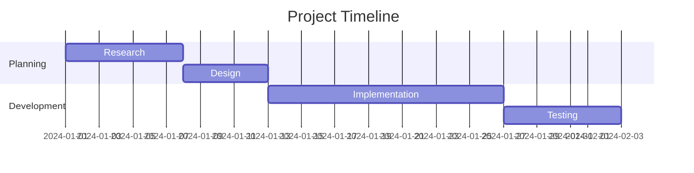
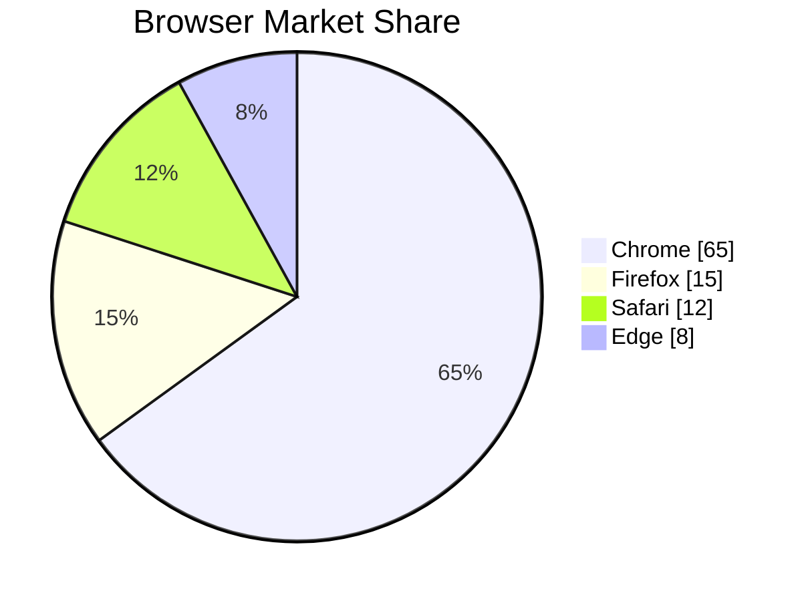

# Descripción

```mermaid
mindmap
    root((Project))
        Planning
            Research
            Requirements
        Development
            Frontend
            Backend
            Database
        Testing
            Unit Tests
            Integration
        Deployment
            Staging
            Production

```

# Ciclo de juego

# Piezas de juego

# Monetización

https://www.mermaideditor.io/

```mermaid
flowchart TD
    A[Start] --> B{Is it working?}
    B -->|Yes| C[Great!]
    B -->|No| D[Debug]
    D --> B
    C --> E[Deploy]
    E --> F[End]
```

```mermaid
stateDiagram-v2
    [*] --> Idle
    Idle --> Processing: Start
    Processing --> Success: Complete
    Processing --> Error: Fail
    Success --> [*]
    Error --> Idle: Retry
```

```mermaid
gantt
    title Project Timeline
    dateFormat YYYY-MM-DD
    section Planning
        Research: a1, 2024-01-01, 7d
        Design: a2, after a1, 5d
    section Development
        Implementation: b1, after a2, 14d
        Testing: b2, after b1, 7d
```

```mermaid
pie showData
    title Browser Market Share
    "Chrome": 65
    "Firefox": 15
    "Safari": 12
    "Edge": 8
```

