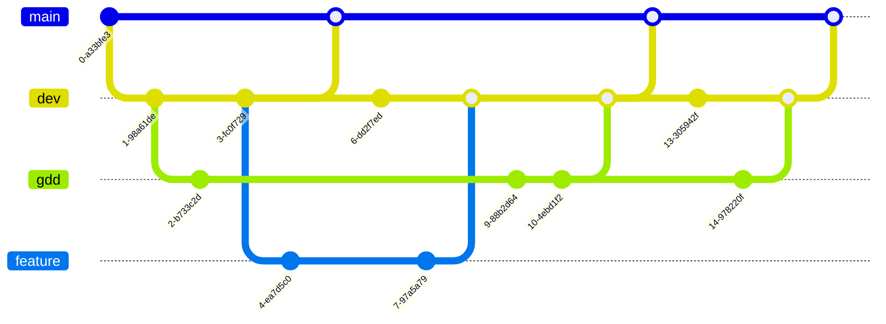
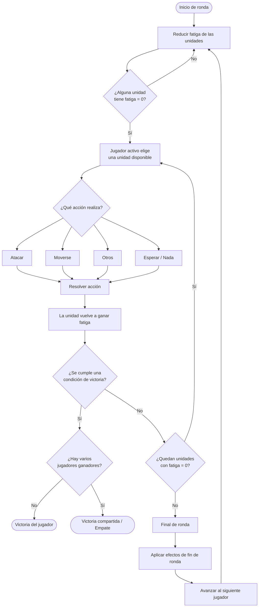

# Introducción

## Sobre este document

Este es el **Documento de Diseño de Juego** de **Grid Tactics**. El control de versiones de este documento tiene rama
propia en el repositorio de la web del juego.

El control de versiones de la web sigue el siguiente esquema:

> La rama `main` contiene únicamente lanzamientos completos. Esta rama se sube automáticamente a github pages.
>
> La rama `dev` es la rama de desarrollo. De esta salen las ramas `gdd` y `feature`.
>
> La carpeta `feature` contiene las ramas de nuevas características de la web.
>
> El GDD se modifica únicamente en la rama `gdd`.

# Grid Tactics

## Descripción general

Grid Tactics es un juego de estrategia en cuadrícula donde el o los jugadores se enfrentan a otros o al entorno para
cumplir uno o vários objetivos. Se rige por un sistema de _fatiga_ que determina la próxima entidad en actuar.

El jugador puede avanzar por una serie de niveles que enseñan a jugar y demuestran diversas mecánicas y situaciones de
juego.

## Ciclo de juego

## Diagrama de navegación de usuario

## Elementos de juego

# Monetización

# Recursos del documento

* [Mermaid visual editor](https://mermaid.ai/products/visual-editor)
* [Mermaid online editor](https://www.mermaideditor.io/)
