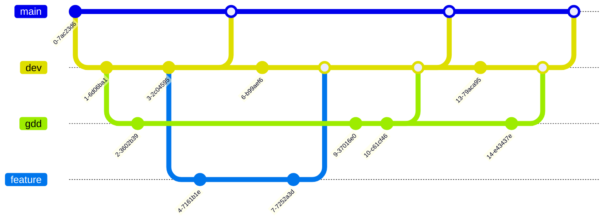

# Introducción

## Sobre este document

Este es el **Documento de Diseño de Juego** de **Grid Tactics**. El control de versiones de este documento tiene rama
propia en el repositorio de la web del juego.

El control de versiones de la web sigue el siguiente esquema:

> La rama `main` contiene únicamente lanzamientos completos. Esta rama se sube automáticamente a github pages.
>
> La rama `dev` es la rama de desarrollo. De esta salen las ramas `gdd` y `feature`.
>
> La carpeta `feature` contiene las ramas de nuevas características de la web.
>
> El documento de niveles se modifica únicamente en la rama `gdd`.

# Niveles de juego

Los siguientes niveles deben seguir una curva de dificultad que muestra nuevas mecánicas, situaciones o unidades al
jugador para prepararle frente a un jugador real.

Los niveles se numeran por el sistema `[Set][Nivel]`. Un nivel pertenece a un set.

## Set 1

### 1.1

#### Nuevo 1.1

* Mover unidades.
* Unidad de infantería.
* Defensa de casilla.

#### Anotaciones 1.1

* No hay fábrica enemiga ni rival.
* Un solo rival con inferioridad numérica.
* No hay niebla de guerra.

### 1.2

#### Nuevo 1.2

* Unidad vehículo (infantería antitanque, artillería y carga de personal).
* Ciudades.

#### Anotaciones 1.2

* No hay fábrica enemiga ni rival.
* Un solo rival con igualdad numérica.
* El terreno tiene un cuello de botella, debe ser difícil ganar si no se aprovecha.
* Mostrar la conquista de ciudades neutrales.
* Mostrar la perdida de ciudades propias por conquista rival. Poner una ciudad cerca del inicio de las unidades rivales.
* No hay niebla de guerra.

### 1.3

#### Nuevo 1.3

* Unidad artillería.

#### Anotaciones 1.3

* No hay fábrica enemiga ni rival.
* Un solo rival con superioridad numérica.
* El terreno tiene un estrecho equidistante a ambos equipos. La ruta del enemigo a ese estrecho es alcanzable por la
  artillería del jugador. El jugador debe posicionar y defender la artillería desde una zona segura para mermar las
  unidades enemigas y tener ventaja al entrar al estrecho.
* En el estrecho hay una ciudad, quien la conquiste tiene ventaja defensiva.
* No hay niebla de guerra.
